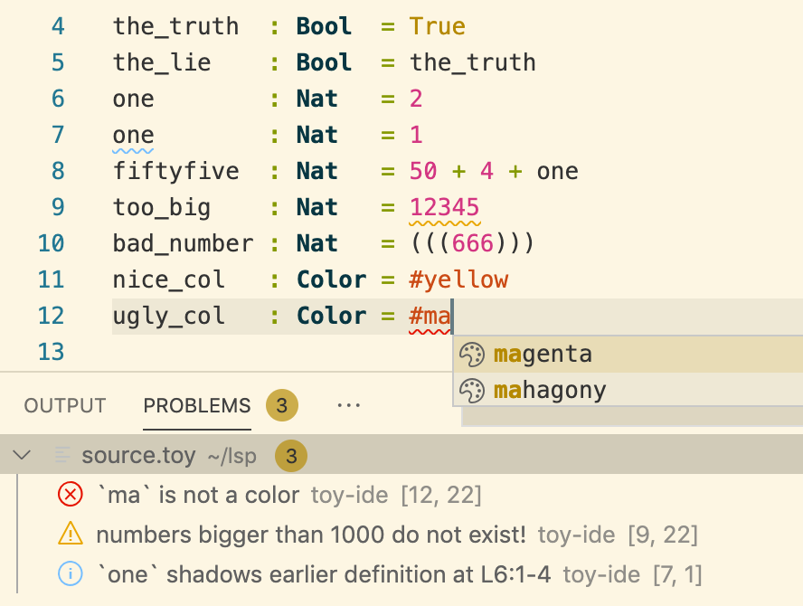

Minimalistic language server (LSP) implementation
=================================================

Language server protocol example for a toy language implemented in Haskell,
using the [haskell-lsp](https://hackage.haskell.org/package/haskell-lsp) 
library under the hood.

The "language" itself is very minimal to keep the implementation simple, 
but the LSP support aims to be somewhat realistic.

IDE features
------------

* ~~syntax highlighting~~ - apparently this is not supported by LSP... (what. the. actual. fuck) 
* parsing, scope and type errors 
* variable scope highlighting, shadowing info
* scope-aware renaming
* type information on hovering
* tab-completion (for colors)
* jump to definition
* ad-hoc diagnostic (warnings for large numbers and rainbow color)

The language
------------

Our toy language consists of top-level declarations. 
Each declaration starts on a new line, and has the format:

```
indentifier : type = expression
```

There are three built-in types:

* `Bool`
* `Nat`
* `Color`

Expressions are built up from literal constants, variables, a built-in infix operator 
(plus), and can use parentheses. Declarations are checked against the type.
For colors, we have a fixed list of pre-defined colors. Color names are
prefixed by a hash `#` character.

Example "program"
-----------------

```
the_truth  : Bool  = True
the_lie    : Bool  = the_truth
one        : Nat   = 1
fiftyfive  : Nat   = 50 + 4 + one
too_big    : Nat   = 12345
bad_number : Nat   = (((666)))
ugly_col   : Color = #black
nice_col   : Color = #rainbow
```

Installation instructions (for VS Code)
--------------------------------------

1. Install `haskell-lsp` and `megaparsec`:
```
$ cabal install haskell-lsp
$ cabal install megaparsec
```
2. Build the server executable:
```
$ ghc -O --make -threaded IDE.hs -o IDE.exe
```
3. Install `npm` (if not already installed)
4. run the following (in the project directory!):
```
$ npm i vscode-languageclient 
```
5. Install VS Code (if not already installed)
6. Open the project directory in VS Code
7. Press F5 to test the language server
8. Open a new text file and paste the example program above. NB: Apparently you
   have to first save the file for the extension to be activated!
9. Play around! For example, F2 does scope-aware renaming, and F12 is jump to definition.

You should see something like this:



To permanently install the extension, copy the whole project into 
the extension folder (?):

* On Windows: `%USERPROFILE%\.vscode\extensions`
* On macOs / Linux: `~/.vscode/extensions`


